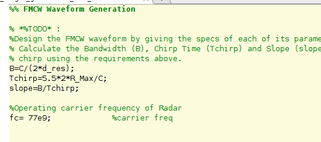
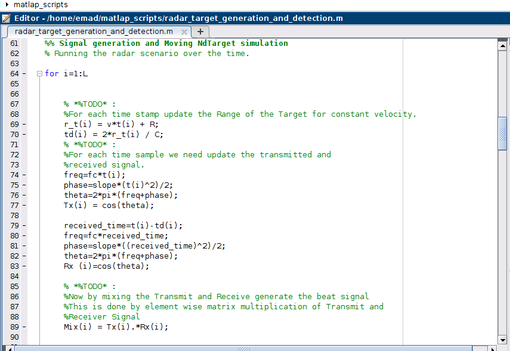
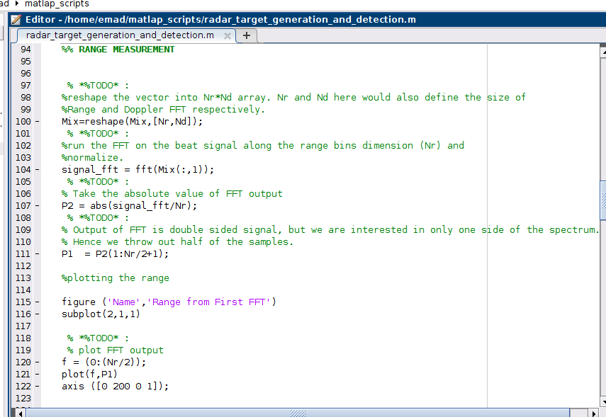
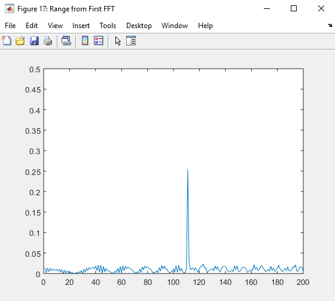
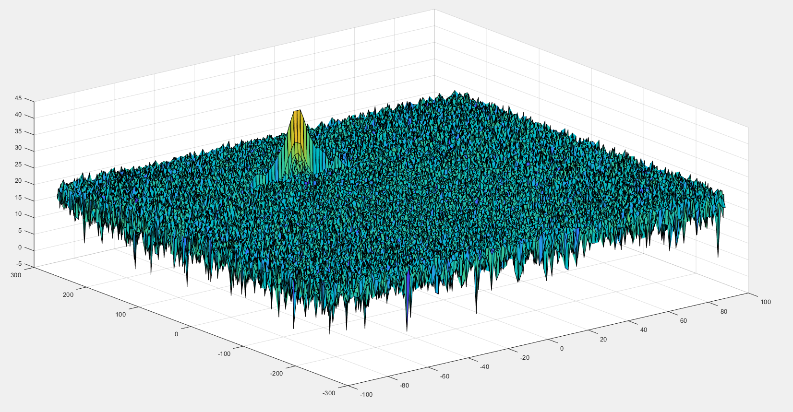
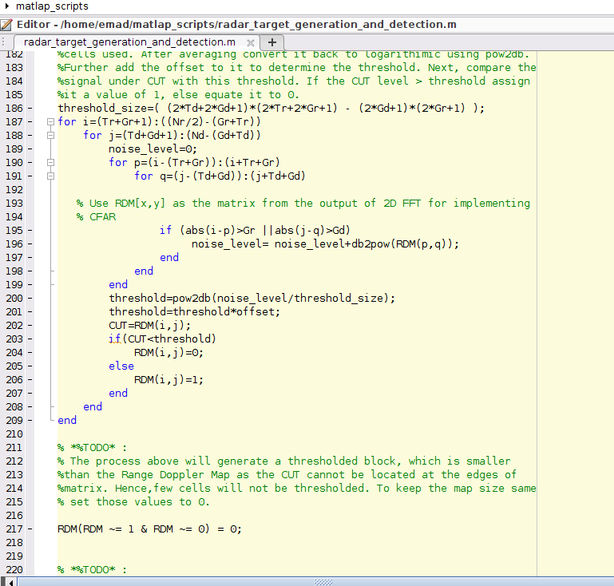
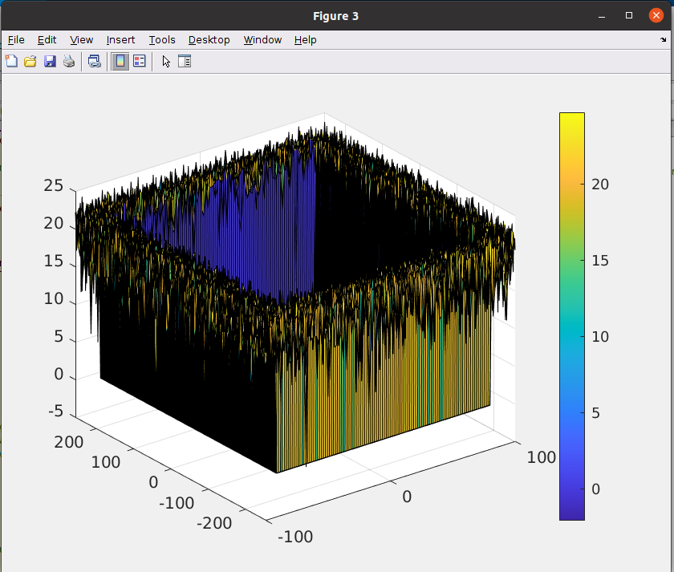
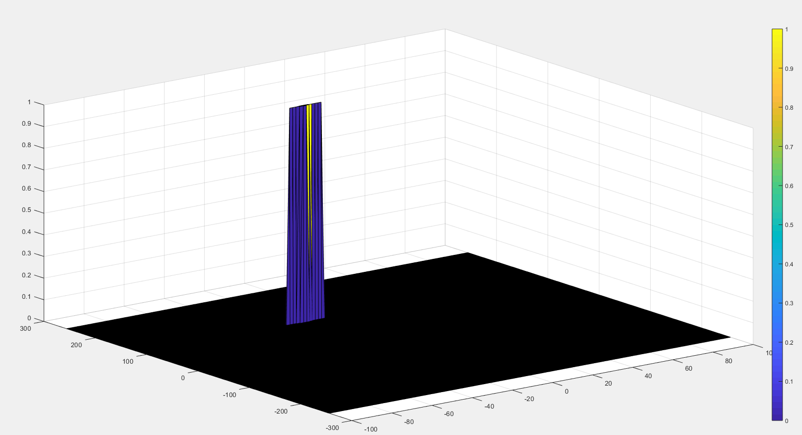

# Radar-Target-Generation-and-Detection

Configure the FMCW waveform based on the system requirements. 

Bandwidth(Bsweep​)=speedoflight/(2∗rangeResolution)

Tchirp​=5.5⋅2⋅Rmax​/c

Giving the slope of the chirp signal

Slope=Bandwidth/TchirpSlope = Bandwidth/T_{chirp}Slope=Bandwidth/Tchirp​

Define the range and velocity of target and simulate its displacement.

I started with 
R=110
v=20

For the same simulation loop process the transmit and receive signal to determine the beat signal

the car displacment can be calculated using the const model velocity.
X=V*t+X0

so the delta time between 2 signals is 

td=2*x/ speed of light

Tx=cos(2π(fc​t+2αt2​))
Rx=cos(2π(fc​(t−τ)+2α(t−τ)2​))

The beat signal can be calculated by multiplying the Transmit signal with Receive signal.
Tx.∗Rx=cos(2π(c2αR​t+c2fc​vn​t))

then we calculate the FFT to convert from time domain to frequancy domain.

##2d:

##3d:

due to unwanted signals which are generally produced by the reflections from the ground, sea, buildings, trees, rain, fog etc.

we make a 2d Clutter Thresholding to decrease the false alarm number.

*Implementation steps for the 2D CFAR:

A-Determine the number of Training cells for each dimension. Similarly, pick the number of guard cells.

I startred with random start and by experment the fianls values were:
Tr=14;
Td=6;
Gr=6;
Gd=3;
offset=2;

B-Slide the cell under test across the complete matrix. Make sure the CUT has margin for Training and Guard cells from the edges.

C-For every iteration sum the signal level within all the training cells. To sum convert the value from logarithmic to linear using db2pow function.

D-Average the summed values for all of the training cells used. After averaging convert it back to logarithmic using pow2db.
    
E-Further add the offset to it to determine the threshold.

F-Next, compare the signal under CUT against this threshold.
    If the CUT level > threshold assign it a value of 1, else equate it to 0.

The process above will generate a thresholded block, which is smaller than the Range Doppler Map as the CUTs cannot be located at the edges of the matrix due to the presence of Target and Guard cells. Hence, those cells will not be thresholded. 
To keep the map size same as it was before CFAR, equate all the non-thresholded cells to 0.

RDM(RDM ~= 1 & RDM ~= 0) = 0;

